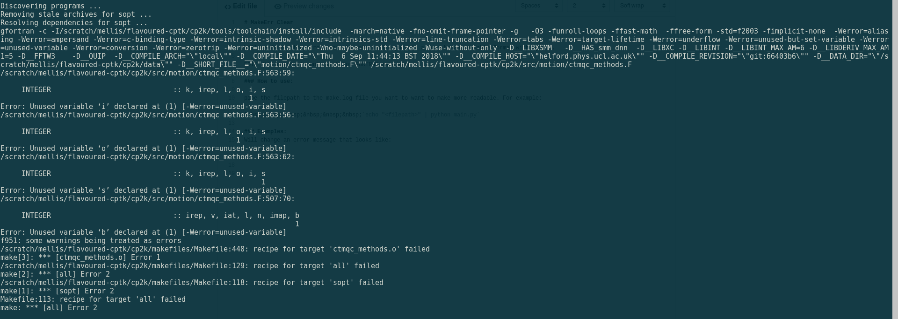

# MakeErr_Clear

Will re-format the error that the make tool ouputs in a more human readable format with python.

NOTE Will currently only work for FORTRAN make errors.

### How to use:

pipe the filepath to the make.log file you want to want to make more readable. For example:

&nbsp;&nbsp;&nbsp;&nbsp;&nbsp;&nbsp;`echo "<filepath>" | python main.py`

### Examples:
Will change an error message that looks like:

to

  
 
